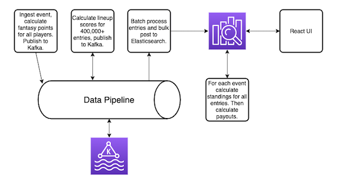

# ContestTracker

An elixir app that allows "replaying" of Daily Fantasy Contests to see what the standings were at any given point of the game. This POC loads a Draftkings Contest from the superbowl which had a first place prize of $1,000,000. First place ended up being a 23 way tie but with this tool we can see there were a few times when 1st place wasn't a tie and a single user was winning $1,000,000.

To process this data, the broadway library was used which made it easy to process events using Kafka. After all the events are processed, they are inserted into Elasticsearch.

## Demo

### Requirements
* Elixir
* Kafka
* Elasticsearch

#### Installation
Note: If data retention is not setup this will write a large amount of data to Kafka. 173 plays * ~450,000 lineups = ~77,850,000 messages.

1. Clone this repo
2. Run `mix deps.get`
3. Run `docker-compose up` to start Kafka/Elasticsearch.
4. Create an events topic, and an entries Kafka topic.
5. Run `iex -S mix run phx.server`
6. (Optional) `unzip data/contest-standings-85042224.csv.zip`
7. (Optional) Kick off data loading process by running `ContestTracker.Ingest.Statistics.parse`